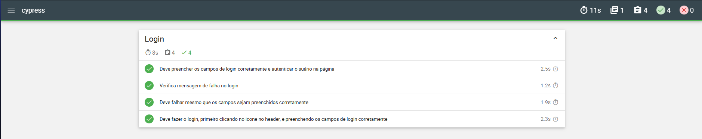
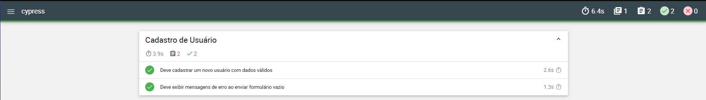
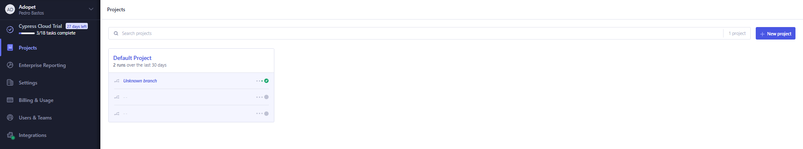
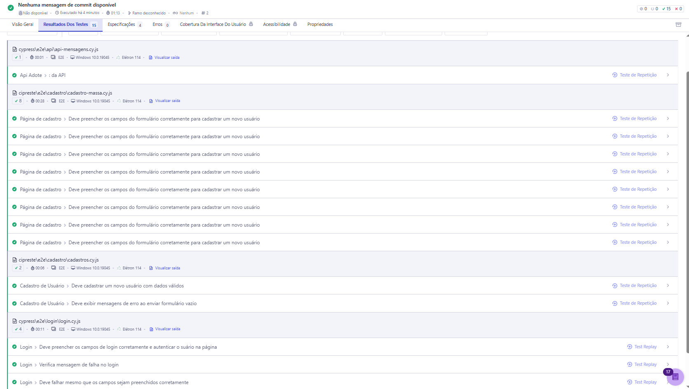

# 🧪 Automação de Testes E2E com Cypress - Adopet

## 📊 Status dos Testes


Projeto de automação de testes End-to-End (E2E) utilizando Cypress, com foco na validação de fluxos críticos como autenticação, cadastro de usuários e testes de API.

---

## 📋 Plano de Teste
[Plano de Teste Completo (DOCX)](docs/plano-de-Teste-Adopet.docx)

---

## 🚀 Tecnologias utilizadas

* Cypress
* Node.js
* Mochawesome (relatórios)
* Cypress Cloud
* JavaScript

---

## 📌 Cenários de teste implementados

### 🔐 Login

* Login com dados válidos
* Login com dados inválidos
* Validação de campos obrigatórios

### 📝 Cadastro

* Cadastro com dados válidos
* Cadastro com dados inválidos
* Cadastro com massa de dados (fixtures)

### 🔌 API

* Testes de envio de mensagens
* Simulação de requisições (stub)

---

## 📸 Evidências

### ✔ Execução dos testes


### 📊 Relatório Mochawesome


### ☁️ Cypress Cloud




🎥 Demonstração dos testes(Login): https://www.youtube.com/watch?v=j_dDYtPhuZY

---

## 🧠 Conceitos aplicados

* Testes End-to-End (E2E)
* Reutilização de código com **Custom Commands**
* Data-driven testing com **fixtures**
* Separação de responsabilidades (ação vs validação)
* Uso de **stubs** para simulação de API
* Boas práticas de automação de testes

---

## 📂 Estrutura do projeto

```
cypress/
  e2e/
    login/
    cadastro/
    api/
  fixtures/
    usuarios.json
  support/
    commands.js
    e2e.js

cypress.config.js
package.json
```

---

## ⚙️ Como executar o projeto

### 🔹 Clonar repositório

```
git clone https://github.com/pedrohbastos94/cypress-e2e-adopet-tests.git
```

### 🔹 Instalar dependências

```
npm install
```

### 🔹 Executar testes (modo interativo)

```
npx cypress open
```

### 🔹 Executar testes (modo headless)

```
npx cypress run
```

---

## 📊 Relatórios e evidências

O projeto gera automaticamente:

* 📄 Relatórios HTML com Mochawesome
* 🎥 Vídeos das execuções
* 📸 Screenshots em caso de falha

Localização:

```
cypress/reports/
cypress/videos/
cypress/screenshots/
```

---

## ☁️ Cypress Cloud

Os resultados dos testes também são integrados ao Cypress Cloud, permitindo:

* Monitoramento das execuções
* Histórico de testes
* Análise de falhas

---

## 🔐 Segurança

Dados sensíveis são protegidos utilizando variáveis de ambiente:

* `cypress.env.json` (não versionado)
* `cypress.env.example.json` (modelo)

---

## 📈 Melhorias futuras

* Integração com CI/CD (GitHub Actions)
* Implementação de Page Object Model (POM)
* Testes visuais
* Testes de performance

---

## 👨‍💻 Autor

Pedro Henrique Ferreira Bastos

* 💼 LinkedIn: https://linkedin.com/in/pedrinbastos
* 💻 GitHub: https://github.com/pedrohbastos94

---

## ⭐ Considerações finais

Este projeto foi desenvolvido com foco em boas práticas de automação de testes, organização de código e simulação de cenários reais de uso.

Sinta-se à vontade para explorar, contribuir ou sugerir melhorias 🚀
